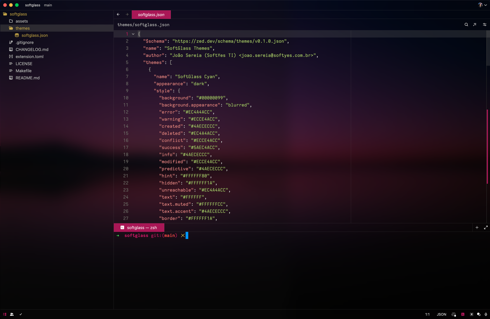
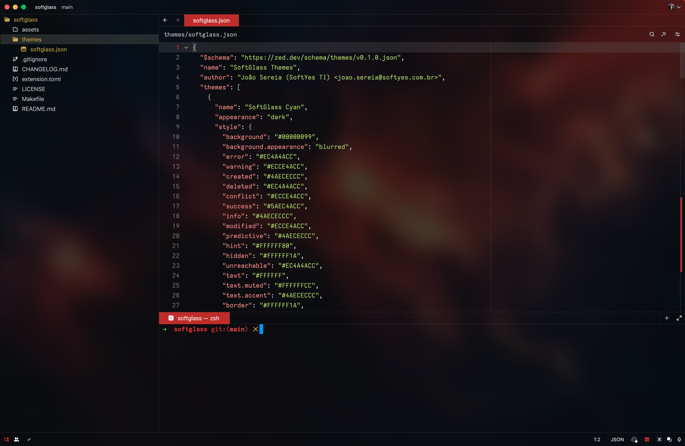
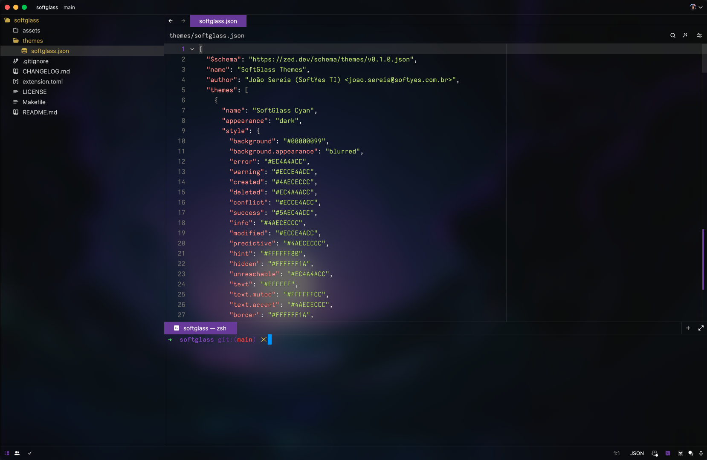

# SoftGlass Themes

Glass themes with color oprions for [Zed Code Editor](https://zed.dev/).

## Images

- Cyan theme
  

- Pink theme
  

- Orange theme
  

- Purple theme
  

- Green theme
  

## Installation

- Manual: Copy the file ./themes/softglass.json to the directory: ~/.config/zed/themes

  ```bash
    yes | cp -rf ./themes/softglass.json ~/.config/zed/themes/softglass.json
  ```

- Auto: In the root of the project, using the GNU/Make utility run the following command:

  ```bash
    make install
  ```

## Contacts

- E-mail: [joao.sereia@softyes.com.br](mailto:joao.sereia@softyes.com.br)
